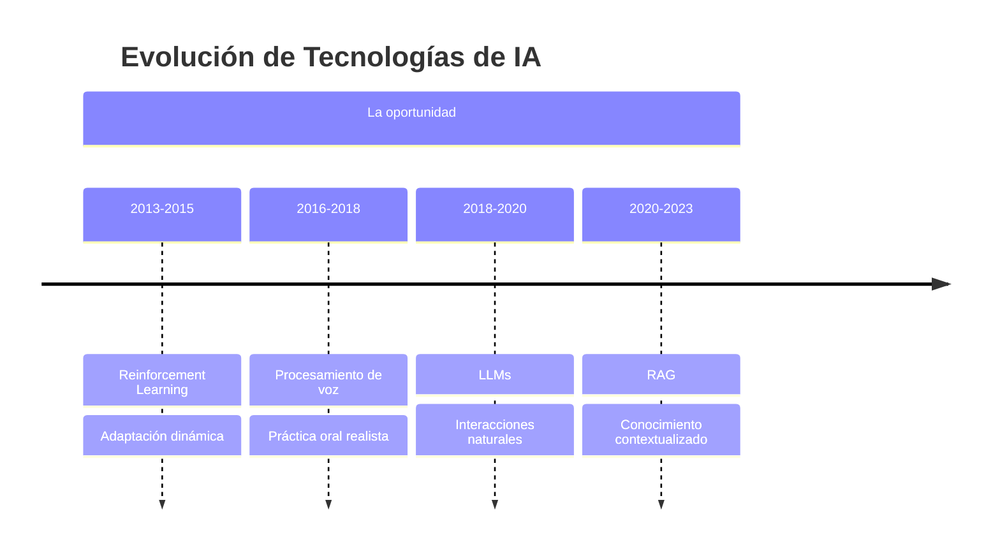
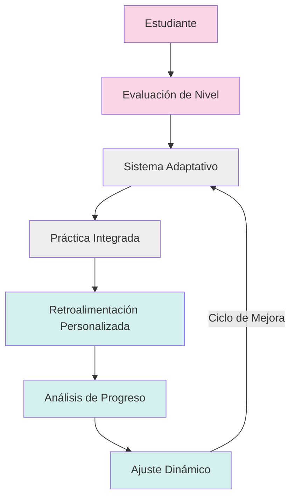
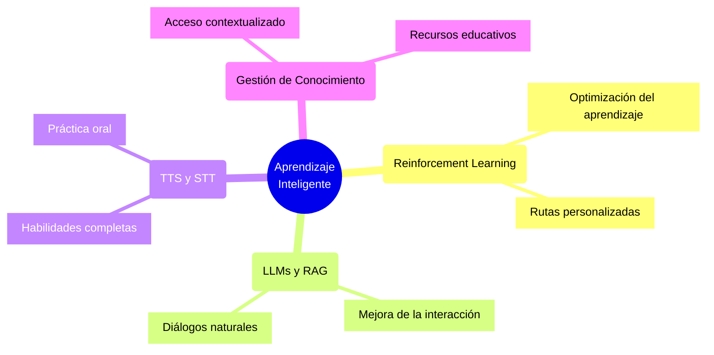
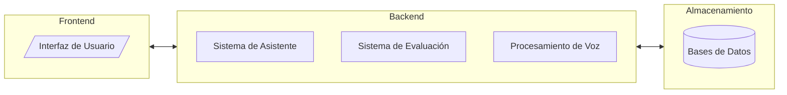
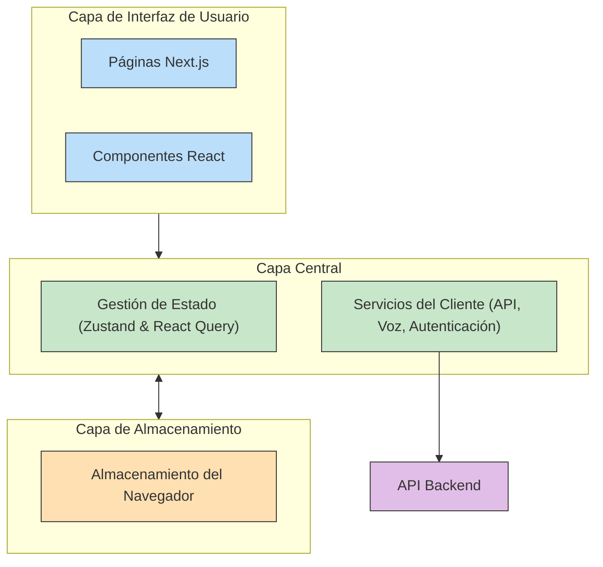
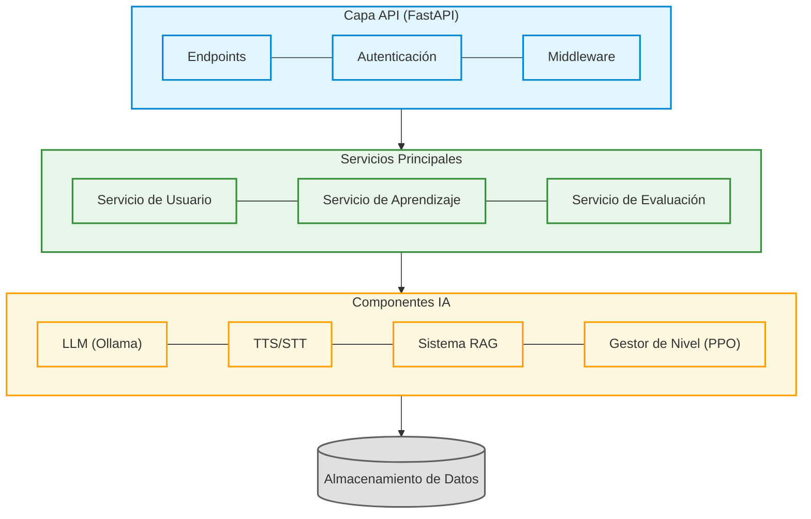
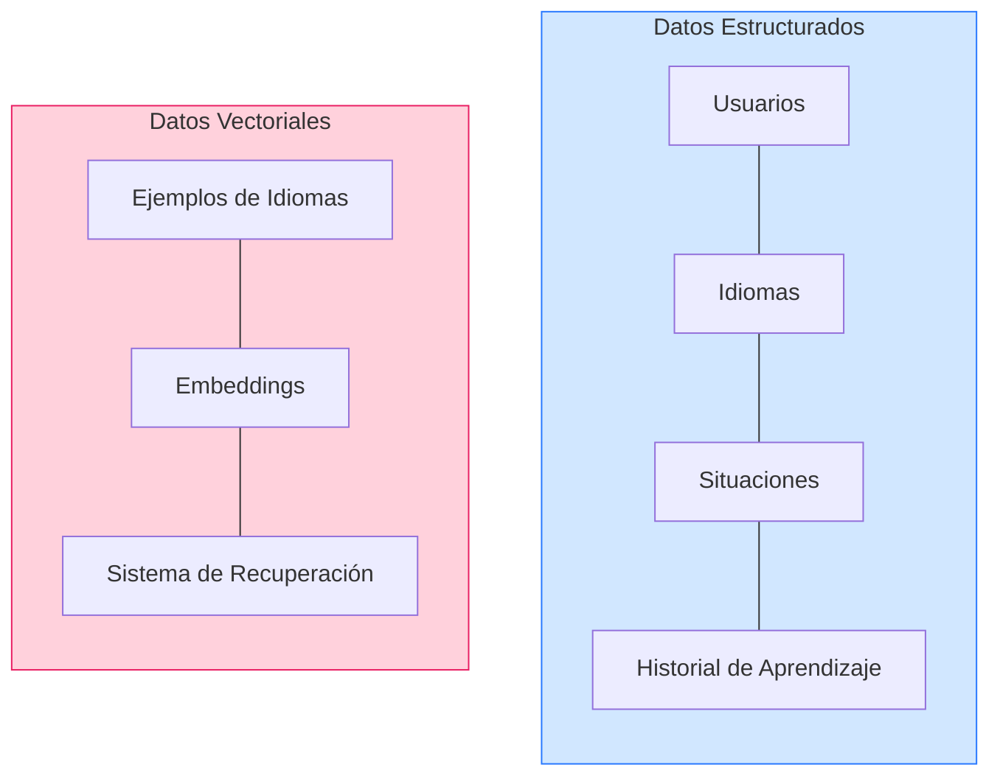
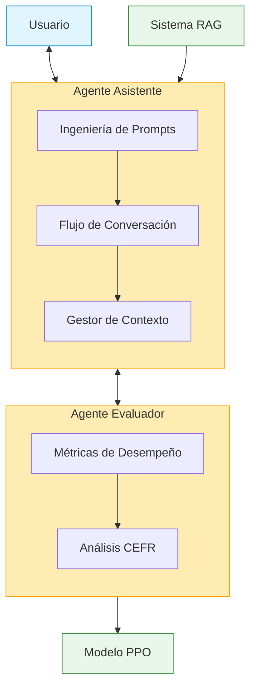
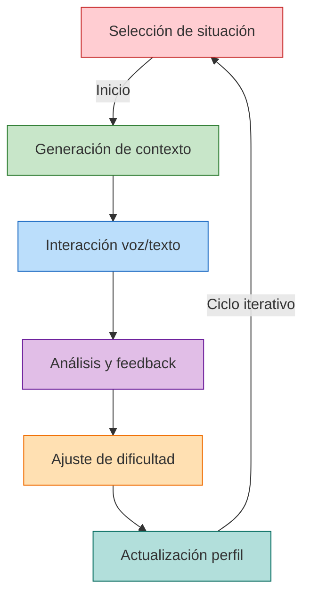
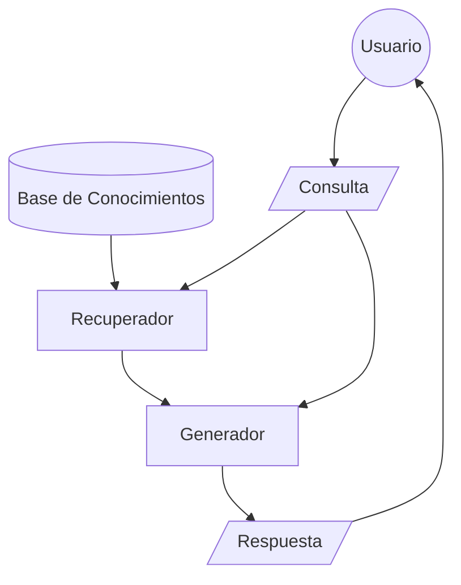

# Aplicación de RL y Transformers para el Aprendizaje de Idiomas

Julio Emanuel Suriano Bryk

---

# Contenido de la presentación:

1. Introducción y motivación
2. Arquitectura del sistema
3. Tecnologías clave
4. Demostración
5. Evaluación y resultados
6. Contribuciones y trabajo futuro
7. Conclusiones

---
layout: section
---

# Introducción y motivación

---
layout: image-right

image: https://images.unsplash.com/photo-1424115087662-5845efc6b366?q=80&w=2576&auto=format&fit=crop&ixlib=rb-4.0.3&ixid=M3wxMjA3fDB8MHxwaG90by1wYWdlfHx8fGVufDB8fHx8fA%3D%3D
---

# ¿Por qué aprendizaje de idiomas?

<v-clicks>

* El aprendizaje de idiomas es un desafío global
* Más de 1.500 millones de personas estudian un segundo idioma
* La personalización es clave para el éxito
* La tecnología puede transformar esta experiencia

</v-clicks>

---
layout: fact
class: "![&>h1]:text-6xl"
---

# "La persona promedio necesita 10,000 horas para dominar un idioma usando métodos tradicionales"

## Malcolm Gladwell

---
class: -mt-6
---

---
layout: two-cols
---

# Objetivo general

Desarrollar un sistema de aprendizaje de idiomas que:

<v-clicks>

* Se adapte dinámicamente al nivel del estudiante
* Ofrezca interacciones conversacionales naturales
* Proporcione retroalimentación personalizada
* Integre práctica oral y escrita

</v-clicks>

::right::

<v-click>

</v-click>

---

# Objetivos específicos

---
layout: section
---

# Arquitectura del sistema

---
class: "[&>.mermaid]:my-10"
---

# Arquitectura general

El sistema emplea una arquitectura modular y escalable a futuro.

<v-click>

### Componentes

* **Frontend**: Experiencia de usuario
* **Backend**: Lógica principal del asistante y procesamiento de voz.
* **Bases de datos**: Almacenamiento estructurado y vectorial

</v-click>

---
layout: two-cols
---

# Frontend 

* Arquitectura de tres capas: Interfaz, Central y Almacenamiento
* Desarrollado con [Next.js](https://github.com/vercel/next.js/) y componentes React especializados
* Gestión de estado con [Zustand](https://github.com/pmndrs/zustand) y [React Query](https://github.com/TanStack/query)
* Servicios integrados de API, voz y autenticación
* Almacenamiento local para preferencias y datos de sesión

::right::

---
layout: two-cols
---

# Backend

* Arquitectura multicapa con API REST en FastAPI
* Servicios para gestión de usuarios, aprendizaje y evaluación
* Integración de IA: LLM, conversión voz-texto, RAG y gestor de nivel
* Almacenamiento dual SQL y vectorial (ChromaDB)
* Sistema adaptativo para personalizar el aprendizaje de idiomas

::right::

---
layout: two-cols
---

# Almacenamiento de Datos

* **SQLite**: Almacena datos estructurados de usuarios, idiomas, situaciones de aprendizaje e historial de progreso

* **ChromaDB**: Base de datos vectorial para ejemplos de idiomas y búsqueda semántica

* **Diseño dual**: Combina almacenamiento relacional y vectorial para optimizar tanto la gestión de datos como la recuperación contextual de ejemplos lingüísticos

::right::

---
layout: two-cols
---

# Sistema Multi-Agente

### Agente Asistente

* Gestiona conversaciones de aprendizaje
* Adapta respuestas al nivel del usuario
* Integra RAG para contenido contextualizado

 

### Agente Evaluador

* Evalúa gramática, vocabulario y fluidez
* Mide cumplimiento de objetivos
* Alimenta el modelo PPO para ajustar dificultad

::right::

---
layout: two-cols
---

# Flujo de interacción

Proceso iterativo y personalizado al usuario

1. Usuario selecciona situación práctica
2. Sistema genera contexto adaptado al nivel
3. Interacción conversacional con voz/texto
4. Análisis en tiempo real y retroalimentación
5. Ajuste dinámico de dificultad
6. Actualización del modelo de estudiante

::right::

---
layout: section
---

# Tecnologías clave

---
layout: two-cols-header
---

# Modelos de lenguaje

::left::

<v-click>

## Phi-4 

 

### Características
- 14B parámetros
- Longitud de contexto: 16k tokens
- Entrenado con datos sintéticos y académicos

 

### Casos de Uso
- Investigación de IA
- Sistemas de propósito general
- Aplicaciones con restricciones de latencia

</v-click>

::right::

<v-click>

## Nomic Embed Text

 

### Características
- Modelo de embeddings de contexto largo
- Supera el rendimiento de OpenAI `text-embedding-ada-002`
- Convierte palabras en vectores que capturan significado

 

### Casos de Uso
- Generación de embeddings
- Búsqueda semántica
- Análisis de similitud textual

</v-click>

---
layout: two-cols-header
---

# Procesamiento de voz

::left::

<v-click>

## Faster-Whisper

 

### Características

- Versión optimizada del modelo Whisper de OpenAI
- Mayor velocidad y eficiencia computacional
- Soporte para múltiples idiomas

 

### Casos de Uso

- Transcripción de audio
- Subtitulado automático
- Accesibilidad

</v-click>

::right::

<v-click>

## Kokoro TTS

 

### Características

- Modelo ligero de 82 millones de parámetros
- Multilenguaje (8 idiomas, 54 voces)
- Rendimiento comparable a modelos más grandes

 

### Casos de Uso

- Asistentes de voz
- Lectura de texto
- Accesibilidad

</v-click>

----

# Modelo de Aprendinzaje por Refuerzo

[*Diagrama conceptual de PPO aplicado a educación*]

* Aprendizaje por refuerzo para optimizar la experiencia educativa
* Observación del desempeño del estudiante
* Decisiones adaptativas sobre nivel y contenido
* Balance entre exploración y explotación

----

# Modelo PPO - Implementación

* **Estado**: 21 dimensiones (métricas de rendimiento + nivel)
* **Acciones**: Disminuir, mantener o aumentar nivel
* **Recompensa**: Basada en decisiones correctas y rendimiento
* **Entrenamiento**: 500,000 pasos con evaluación periódica

[*Gráfico simple de aprendizaje del modelo*]

---
layout: two-cols
---

# Sistema RAG

1. **Vectorización** de consulta y documentos
2. **Recuperación** de contenido relevante
3. **Generación** de respuestas contextualizadas
4. **Integración** con el nivel del estudiante

::right::

---
layout: section
---

# Demostración

----

# Demo - Interfaz principal

[*Video/GIF o captura de la interfaz principal*]

* Panel de chat interactivo
* Controles de voz
* Indicadores de nivel
* Opciones de configuración

*[Punto para demostración en vivo]*

----

# Demo - Conversación

[*Video/GIF o captura de una conversación*]

* Ejemplo de diálogo adaptado al nivel
* Corrección contextual de errores
* Uso de voz para práctica oral

*[Continuación de demostración en vivo]*

----

# Demo - Análisis de progreso

[*Video/GIF o captura del panel de análisis*]

* Visualización de métricas de aprendizaje
* Progreso en diferentes dimensiones lingüísticas
* Recomendaciones personalizadas

*[Finalización de demostración en vivo]*

---
layout: section
---

# Evaluación y resultados

----

# Evaluación técnica - Frontend

* **Síntesis de voz (TTS)**:
  * Latencia: 50ms por frase
  * Memoria: 120MB promedio
  * Inicialización: 1.2 segundos

* **Reconocimiento de voz (STT)**:
  * Latencia: 100ms para frases cortas
  * Precisión: 85% en ambiente controlado
  * Degradación en ruido: 10-15%

[*Gráfico simple de métricas*]

----

# Evaluación técnica - Backend

* **Sistema RAG**:
  * Latencia de búsqueda: 75ms
  * Precisión recuperación: 82%
  * Relevancia contextual: 80%

* **Sistema PPO**:
  * Tiempo de convergencia: 15 episodios
  * Precisión decisiones: 95%
  * Tiempo de inferencia: 35ms

[*Gráfico simple de rendimiento*]

----

# Evaluación con usuarios

[*Gráfica de satisfacción de usuarios*]

* Pruebas con 10 participantes durante 2 semanas
* **Facilidad de uso**: 4.0/5
* **Satisfacción con funcionalidades**: 3.9/5
* **Percepción de utilidad**: 3.9/5
* **Preferencia vs métodos tradicionales**: 78%

----

# Fortalezas destacadas

* **Diálogos adaptativos**: 4.1/5
* **Análisis de progreso**: 4.2/5
* **Relevancia de escenarios**: 4.2/5
* **Adaptación al nivel**: 4.0/5

[*Gráfico de barras con puntuaciones*]

---
layout: section
---

# Contribuciones y trabajo futuro

----

# Contribuciones principales

* **Modelo PPO optimizado para educación lingüística**
  * 95% de precisión en decisiones de adaptación

* **Integración efectiva LLM+RAG en contexto educativo**
  * Respuestas contextualmente relevantes y pedagógicas

* **Pipeline optimizado de procesamiento de voz**
  * Latencias por debajo del umbral perceptible (200ms)

----

# Aportaciones metodológicas

* **Framework de evaluación multidimensional**
  * Métricas para gramática, vocabulario, fluidez y objetivos

* **Metodología de generación de escenarios**
  * Simulación de patrones reales de aprendizaje

* **Diseño centrado en el estudiante**
  * Adaptación a necesidades pedagógicas reales

----

# Limitaciones actuales

* **Técnicas**:
  * STT insuficiente para acentos no nativos fuertes
  * Tiempo de carga inicial (5-8 segundos)

* **Pedagógicas**:
  * Cobertura limitada de dominios específicos
  * Adaptación insuficiente a estilos de aprendizaje

* **Validación**:
  * Muestra reducida (n=10)
  * Período de evaluación corto (2 semanas)

----

# Trabajo futuro

* **Evaluación exhaustiva**
  * Muestra ampliada (n>100)
  * Estudio longitudinal (3-6 meses)

* **Mejoras técnicas**
  * Refinamiento del modelo PPO con datos reales
  * Adaptación STT para acentos no nativos

* **Expansión de funcionalidades**
  * Módulos para dominios especializados
  * Componente social para práctica colaborativa

---
layout: section
---

# Conclusiones

----

# Conclusiones

* La combinación RL + Transformers + RAG permite **superar** limitaciones de sistemas tradicionales

* Los resultados preliminares muestran el potencial para transformar el aprendizaje de idiomas

* La personalización dinámica y las interacciones naturales son clave para mejorar la experiencia educativa

* Un paso hacia educación adaptativa, contextual y centrada en el estudiante

----

# Repositorios públicos

* **Frontend**:
  * [github.com/EmaSuriano/language-learning-client](https://github.com/EmaSuriano/language-learning-client)
  * Next.js, TypeScript, Tailwind CSS

* **Backend**:
  * [github.com/EmaSuriano/language-learning-server](https://github.com/EmaSuriano/language-learning-server)
  * FastAPI, Python, LangChain, Stable-Baselines3

* **Licencia MIT**: Código abierto para la comunidad

---
layout: fact
---

# ¡Gracias por su atención!

---
layout: recording

direction: right

# the image source
image: /recording/learning-progress.gif
---

# Learning progress

---
layout: recording

direction: left

# the image source
image: /recording/learning-progress.gif
---

# Learning progress

---
layout: iframe
url: https://emasuriano.github.io/language-learning-client/
---

