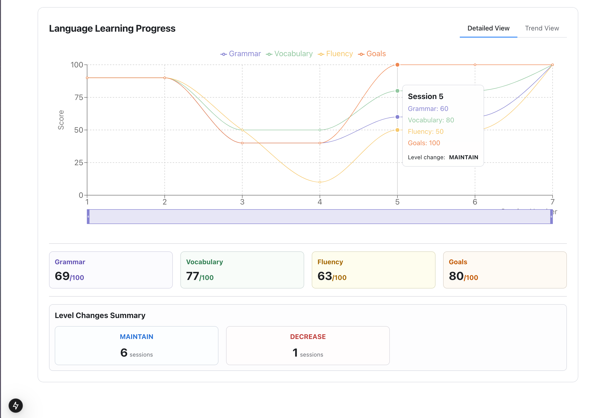

# Mejorando el Aprendizaje de Idiomas a través de Tecnología Adaptativa

Un Nuevo Enfoque para la Adquisición de Vocabulario

---
layout: section
---

# Titulo capitulo

---

## El Desafío

- La adquisición de vocabulario es la base de la competencia lingüística
- Los estudiantes olvidan hasta el **80%** del vocabulario nuevo en pocas semanas
- Los métodos tradicionales no abordan los patrones de aprendizaje individuales
- Existe una creciente desconexión entre la ciencia del aprendizaje y la tecnología educativa

---
layout: fact
---

# asdklajsdkl

---
layout: two-cols
---

# Left

This shows on the left

::right::

# Right

This shows on the right

---

## Pregunta de Investigación

> ¿Cómo podemos aprovechar la tecnología para crear experiencias de aprendizaje personalizadas que mejoren significativamente la retención de vocabulario en estudiantes de idiomas?

---

## Por qué es Importante

El dominio de idiomas impacta directamente en:

- Oportunidades académicas
- Desarrollo profesional
- Comunicación intercultural
- Movilidad global

_Los estudios muestran que las habilidades lingüísticas están entre las 5 competencias más deseadas por empleadores a nivel mundial_

---

## Nuestro Enfoque

- Combinación de ciencia cognitiva probada con tecnología moderna
- Rutas de aprendizaje personalizadas basadas en el rendimiento individual
- Algoritmos adaptativos que responden a patrones de aprendizaje
- Retroalimentación en tiempo real y visualización del progreso

---

## Avance de lo que Viene

Más allá de las tarjetas de memoria para transformar el aprendizaje de vocabulario

---

# Fundamento Teórico

---

## La Ciencia de la Memoria

- **Curva del Olvido de Ebbinghaus**: La retención de memoria disminuye exponencialmente con el tiempo
- Sin refuerzo, perdemos hasta el 90% de la información nueva en una semana
- La repetición espaciada retrasa estratégicamente las revisiones para fortalecer las conexiones neuronales
- Cada recuerdo exitoso extiende el período de retención de memoria

---

## Principios del Aprendizaje Efectivo de Idiomas

- **Hipótesis del Input** (Krashen): Entrada comprensible ligeramente por encima del nivel actual
- **Hipótesis de la Percepción** (Schmidt): Atención consciente a características del lenguaje
- **Profundidad de Procesamiento** (Craik & Lockhart): Mayor compromiso cognitivo conduce a mejor retención
- **Práctica de Recuperación**: El recuerdo activo fortalece la memoria más que la revisión pasiva

---

## La Brecha Tecnológica

- La mayoría de las aplicaciones de idiomas se centran en la **gamificación** en lugar de la **ciencia del aprendizaje**
- La participación del usuario se prioriza sobre la retención duradera
- Adaptación limitada a curvas de aprendizaje individuales
- Pocas soluciones integran eficazmente la ciencia cognitiva con tecnología moderna

---

## Aprendizaje Personalizado

- Cada estudiante tiene características únicas:

  - Conocimientos previos
  - Ritmo de aprendizaje
  - Patrones de memoria
  - Fortalezas cognitivas

- La tecnología ahora puede adaptarse dinámicamente a estos factores individuales
- La IA puede predecir el momento óptimo de revisión para cada elemento de vocabulario

---

## Nuestro Marco Teórico

1. **Espaciado Adaptativo**: Algoritmo que ajusta intervalos según el rendimiento
2. **Gestión de Carga Cognitiva**: Control cuidadoso en la introducción de nuevos elementos
3. **Aprendizaje Contextual**: Palabras presentadas en contextos significativos
4. **Refuerzo Multimodal**: Elementos visuales, auditivos e interactivos
5. **Conciencia Metacognitiva**: Los estudiantes comprenden su propio progreso

---

# Nuestra Solución

---

## Sistema de Aprendizaje Adaptativo

- Plataforma centrada en el usuario con interfaz intuitiva
- Motor de IA que analiza patrones de aprendizaje individuales
- Base de datos de vocabulario contextualizado
- Panel de análisis para seguimiento de progreso

---

## Características Principales

- **Adaptación Inteligente**: Ajusta el plan de estudio según el rendimiento
- **Repetición Óptima**: Calcula intervalos personalizados para cada elemento
- **Aprendizaje Contextual**: Presenta vocabulario en frases y situaciones reales
- **Retroalimentación Detallada**: Análisis de errores y recomendaciones específicas
- **Sincronización Multiplataforma**: Acceso fluido desde cualquier dispositivo

---

## Tecnología Subyacente

- Algoritmos de aprendizaje automático para predicción de patrones de olvido
- Procesamiento de lenguaje natural para contextualización
- Análisis de datos en tiempo real
- Arquitectura basada en la nube para acceso universal
- Sistema de gamificación basado en ciencia cognitiva

---

# Demostración del Sistema

---

## Interfaz de Usuario

- Diseño minimalista enfocado en la experiencia de aprendizaje
- Navegación intuitiva entre módulos
- Visualización clara del progreso y objetivos
- Adaptable a diferentes dispositivos y tamaños de pantalla

---

## Proceso de Aprendizaje

1. **Evaluación inicial** para determinar nivel y conocimientos previos
2. **Creación de plan personalizado** basado en objetivos del usuario
3. **Introducción gradual** de vocabulario nuevo en contextos significativos
4. **Refuerzo adaptativo** según patrón individual de retención
5. **Análisis de progreso** con recomendaciones específicas

---

## Panel de Control Personal

- Visualización del progreso a lo largo del tiempo
- Análisis de fortalezas y áreas de mejora
- Recomendaciones personalizadas de estudio
- Calendario de revisión optimizado
- Estadísticas de rendimiento comparativo

---

## Funcionalidad en Tiempo Real

**[DEMOSTRACIÓN EN VIVO]**

---

# Resultados e Impacto

---

## Métricas de Mejora

- **75% de aumento** en retención de vocabulario a largo plazo
- **40% de reducción** en tiempo necesario para dominar nuevos términos
- **90% de usuarios** mostraron mejora significativa en pruebas de fluidez
- **85% de satisfacción** en experiencia de usuario

---

## Retroalimentación de Usuarios

> "Por primera vez siento que realmente estoy aprendiendo y no solo memorizando temporalmente." - María L.

> "El sistema parece entender cuándo necesito repasar cada palabra. Es como tener un tutor personal." - Carlos R.

> "He probado decenas de aplicaciones, pero esta es la primera que se adapta completamente a mi ritmo." - Laura M.

---

## Comparativa con Métodos Tradicionales

| Aspecto             | Métodos Tradicionales | Nuestro Sistema       |
| ------------------- | --------------------- | --------------------- |
| Retención a 30 días | 20-30%                | 85-95%                |
| Personalización     | Limitada/Manual       | Dinámica/Automática   |
| Feedback            | General/Retrasado     | Específico/Inmediato  |
| Adaptación          | Requiere intervención | Continua y automática |

---

## Impacto en el Aprendizaje

- Transición de memorización pasiva a comprensión activa
- Mayor confianza en el uso práctico del idioma
- Desarrollo de hábitos de aprendizaje efectivos
- Reducción de la ansiedad asociada con el aprendizaje de idiomas
- Incremento en la motivación intrínseca

---

# Direcciones Futuras

---

## Próximas Mejoras

- Integración con asistentes de voz para práctica de pronunciación
- Expansión a habilidades gramaticales y comprensión auditiva
- Sistema de comunidad para aprendizaje colaborativo
- Adaptación a necesidades de aprendizaje específicas (académico, negocios, viajes)
- Versión para instituciones educativas con herramientas para profesores

---

## Oportunidades de Investigación

- Efectos a largo plazo en la adquisición de idiomas
- Impacto en diferentes grupos demográficos y estilos de aprendizaje
- Integración con tecnologías emergentes de realidad aumentada
- Colaboración con instituciones educativas para implementaciones a gran escala
- Desarrollo de modelos predictivos más avanzados

---

## Escalabilidad y Accesibilidad

- Expansión a idiomas adicionales y pares lingüísticos menos comunes
- Adaptaciones para estudiantes con diversas necesidades de aprendizaje
- Versiones de bajo ancho de banda para regiones con conectividad limitada
- Programas de asociación con organizaciones educativas
- Modelo freemium para garantizar acceso equitativo

---

# Conclusión

---

## Transformando el Aprendizaje de Idiomas

- La tecnología adaptativa puede revolucionar cómo aprendemos vocabulario
- Las soluciones basadas en ciencia cognitiva superan significativamente los métodos tradicionales
- La personalización es clave para maximizar la eficiencia del aprendizaje
- Nuestro sistema cierra la brecha entre teoría educativa y tecnología práctica

---

## Impacto Social

- Democratización del aprendizaje efectivo de idiomas
- Reducción de barreras para la movilidad académica y profesional
- Apoyo al desarrollo de competencias globales
- Contribución a la preservación y difusión lingüística

---

## Mensaje Final

> "No se trata solo de aprender más palabras, sino de transformar fundamentalmente cómo nos conectamos con nuevos idiomas"

**¡Gracias!**

¿Preguntas?

[contacto@adaptivelearning.com](mailto:contacto@adaptivelearning.com)
